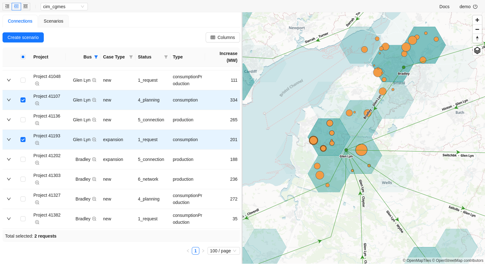

# Gridcapacity Map

[](https://bestpractices.coreinfrastructure.org/projects/8073)

Ecosystem of tools for power grid visualization, modelling and analysis



## Integrations

| Data format       | powerflow | geodata | calculation in cloud | solver        | examples                         |
| ----------------- | --------- | ------- | -------------------- | ------------- | -------------------------------- |
| psse              | yes       | no      | no                   | Siemens PSS®E | `data/gridcapacity/savnw`        |
| pandapower (json) | yes       | yes     | yes                  | PandaPower    | `data/gridcapacity/mv_oberrhein` |
| CIM CGMES         | yes       | yes     | yes                  | PandaPower    | `data/gridcapacity/cim_cgmes`    |
| pypower, matpower | yes       | no      | yes                  | PandaPower    |                                  |
| PowSyBl           | WIP       | WIP     | WIP                  | WIP           |                                  |

## Development

### Prerequisites

- `podman`, `podman-docker` preferred due to docker [licensing policy](https://docs.docker.com/subscription/desktop-license/)
- `docker`, `docker-compose` are supported as alternative
- `vscode` with [devcontainer](https://microsoft.github.io/code-with-engineering-playbook/developer-experience/devcontainers/) extension configured correctly
- Linux-based os (mac/win - possible, needs additional efforts)

### Setup

Spin up infra with synthetic demo data

```
docker-compose up
```

This will take a while. Once setup is complete open [web frontend](http://localhost:3000) in your favourite browser. Default username and password for authentication is `demo`.

Synthetic data used for visualization is sourced from `data` dir.

### Quickstart

For development quickstart please read [developing.md](docs/developing.md)

## Contributing

Please read [CONTRIBUTING.md](CONTRIBUTING.md) for details on our code of conduct, and the process for submitting pull requests to us.

## Versioning

We use [SemVer](http://semver.org/) for versioning. For the versions available, see the [tags on this repository](https://github.com/gridcapacitymap/gridcapacitymap-web/tags).

## Authors

See the list of [contributors](https://github.com/gridcapacitymap/gridcapacitymap-web/graphs/contributors)

## License

This project is licensed under the Apache License 2.0 - see the [LICENSE](LICENSE) file for details
