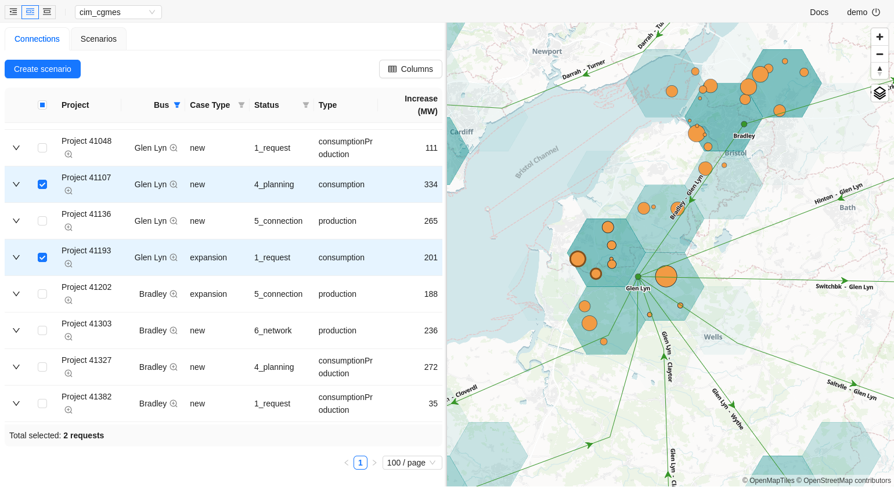

# Gridcapacity web

Ecosystem of tools for power grid visualization, modelling and analysis. Documentation (work in progress) is available in `docs/`.



## Supported integrations

| Data format       | powerflow | geodata | calculation in cloud | solver        | examples                         |
| ----------------- | --------- | ------- | -------------------- | ------------- | -------------------------------- |
| psse              | yes       | no      | no                   | Siemens PSS®E | `data/gridcapacity/savnw`        |
| pandapower (json) | yes       | yes     | yes                  | PandaPower    | `data/gridcapacity/mv_oberrhein` |
| CIM CGMES         | yes       | yes     | yes                  | PandaPower    | `data/gridcapacity/cim_cgmes`    |
| pypower, matpower | yes       | no      | yes                  | PandaPower    |                                  |
| PowSyBl           | WIP       | WIP     | WIP                  | WIP           |                                  |

# Development setup

## Prerequisites

- `podman`, `podman-docker` preferred due to [licensing issues with docker](https://docs.docker.com/subscription/desktop-license/)
- `docker`, `docker-compose` are supported as alternative
- `vscode` with [devcontainer](https://microsoft.github.io/code-with-engineering-playbook/developer-experience/devcontainers/) extension configured correctly
- linux-based os (mac/win - possible, needs additional efforts)

## Setup

Spin up infra with syntetic demo data

```
docker-compose up
```

Syntetic data used for visualization is sourced from `data` dir.
It can be imported from [swagger UI](http://localhost:8000/docs) and will be visualized on [webgis](http://localhost:3000).
Default username and password for authentication is `demo`.

## Database & migrations

Detect model changes and allow alembic to generate corresponding migration

```
docker-compose exec backend bash -c 'alembic revision --autogenerate -m "My auto migration"'
```

Upgrade database to latest migration (manually)

```
docker-compose exec backend bash -c 'alembic upgrade head'
```

Downgrade to previous db revision

```
docker-compose exec backend bash -c 'alembic downgrade -1'
```

## Purge development environment

The command will clean all development environment, except downloaded images from docker hub

```
docker-compose down --remove-orphans --rmi local -v
```

Remove only database container and volume

```
docker-compose rm -s -v postgreshost redis
```

## Benchmarking

A glimpse on service performance

```
docker run --network=host --rm skandyla/wrk -t12 -c400 -d30s http://localhost:8000/api/connection-requests/
```

