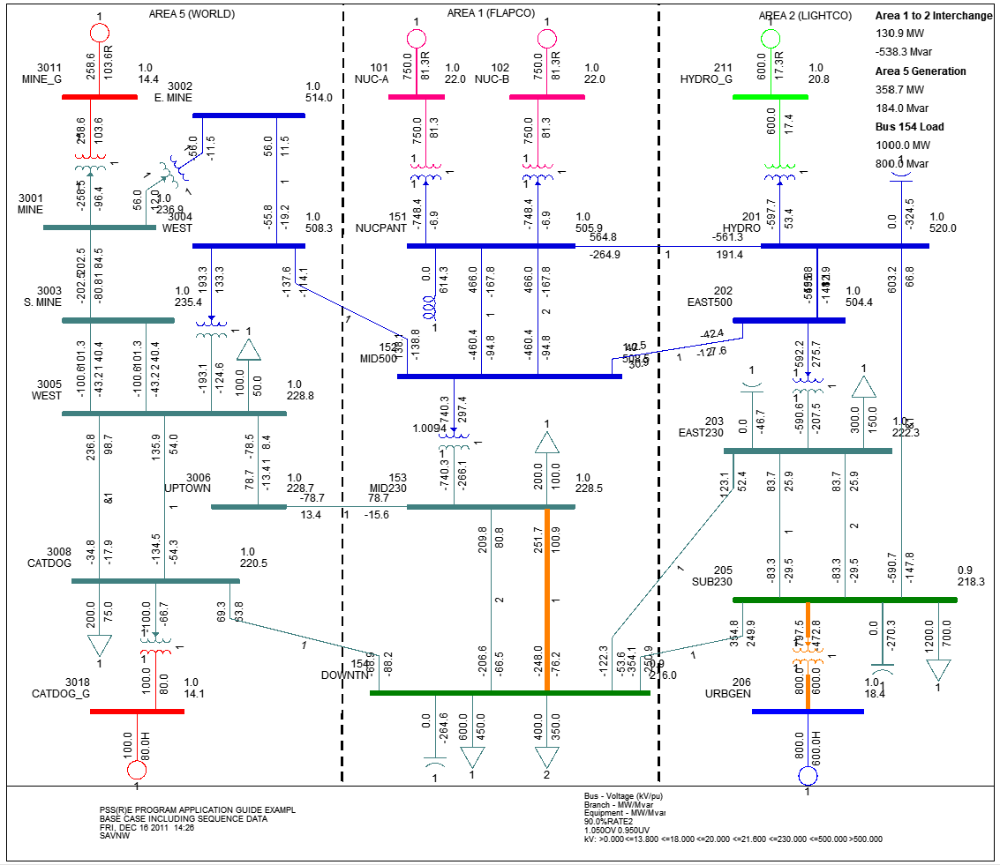

Dataset for gridcapacity calculations with [PSS®E 35](https://www.siemens.com/global/en/products/energy/grid-software/planning/pss-software/pss-e.html) solver backend

Bases on example case `savnw` included into psse package. Contains 23 buses

Subsystems json dump is generated with command below.
This test case is focused on usage on windows with psse solver backend.

Connection requests location randomization is recommended with setting of 10 000 meters from target connection points.

- config file (`sample_config.json`) for `gridcapacity` calculations
- base scenario headroom (`savnw_headroom.json`). Built with `pipenv run python -m gridcapacity sample_config.json`
- subsystems data (`savnw_exported_data.json`). Built with `pipenv run python -m gridcapacity.convert_case2json savnw.sav`
- Corresponding geospatial data for grid model provided in `sawnv_geo.json`. Data is fictional and mapped to Iceland
