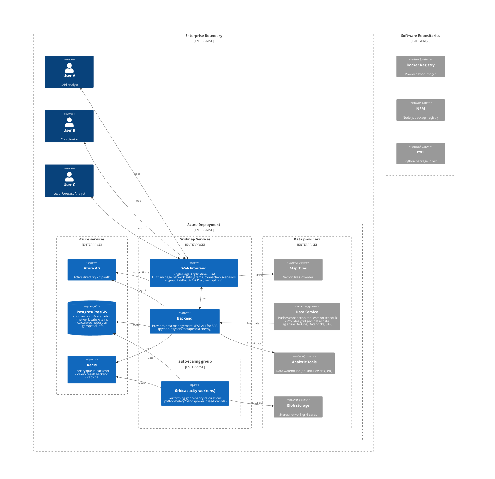
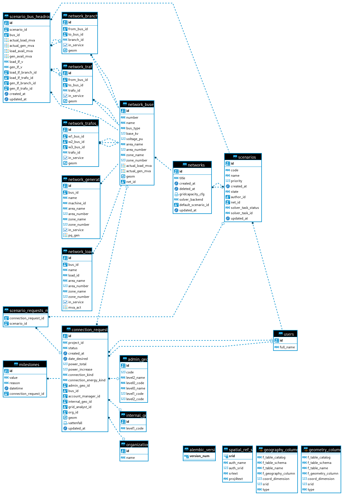

# Gridcapacity Map deployment overview

As an example Azure ISP is used.

## Gridmap Services

### Backend

Acts as central point to collect and store data about network grid, connection requests, scenarios and corresponding headroom data.
Solution is geared toward using with containers, is stateless and is able to scale horizontally.

Build with Open Source Software(OSS). Highlights:

- python
- pandas
- sqlalchemy (with postgreSQL)
- fastapi + asyncio
- pydantic
- celery

Suggested way to grow is service-oriented architecture (SOA) using message queues to communicate between services.

### Gridcapacity worker

Gridcapacity is a standalone command-line interface (CLI) tool that provides easy integration with popular solutions to perform powerflow calculations for electrical networks. Currently, gridcapacity focuses on working with Siemens PSSE and pandapower.

Tech stack highlights:

- python
- celery
- sqlalchemy
- gridcapacity (pandapower)

Gridcapacity worker is a service that receives configuration for powerflow calculation via celery (task queue) and runs gridcapacity under the hood.

Service requires network models to be available on file system. This can be achieved by mounting corresponding volume into container with the data.

### Web Frontend

Classical SPA providing

- webGIS features to visualize geospatial data
- features to view, filter connection requests
- features to create/delete connection scenarios
- run powerflow calculations for selected scenarios & inspect results
- assist in analysis of network bottlenecks
- possibility to share connection scenarios between users
- authentication against configured identity provider (Azure AD) - TBD
- features for ACL (access control list) management - TBD

Tech stack highlights:

- Typescript
- React
- maplibreGL
- Ant Design (UI components library)
- Vite (build system)

## Data providers

### Map Tiles

Vector tiles are required as base layer for rendering map view. This can be either in-house deployment, or 3rd party service, like maptiler.com

### Data Service

Provides connection requests on regular basis to backend, e.g. via REST API. Connection request data is not updated often (?) and this process can be done weekly.

Another essential component to visualize powergrid is network geospatial data. It is expected to be provided as geojson data by data service. This data is mostly static(?) and can be uploaded once per network.

### Blob Storage

Provides a way to mount powergrid case files into gridcapacity worker container. This data will be sensitive.

## Azure Services

### PostgreSQL & PostGIS

Used as main data storage for backend. PostGIS is used for querying and aggregating geospatial data of connection requests and network subsystems.

### Azure AD

Provides authentication capabilities.

### Redis

Used for celery (distributed task queue) as results backend, and queue backend (recommended to replace with RabbitMQ or alternative in production).

Also results of some heavy db queries that aggregate big chunks of data are cached in redis.
